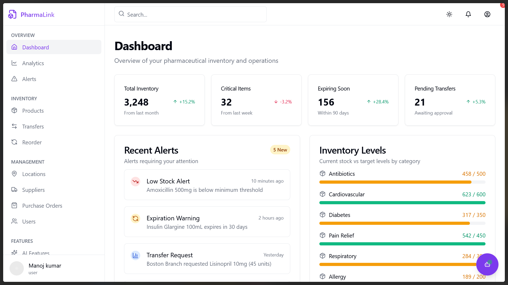

# PharmaLink - Advanced Pharmacy Inventory Management System

PharmaLink is a next-generation inventory management application specifically designed for pharmacies, helping them track, manage, and optimize their pharmaceutical supplies through an AI-powered platform.



## 🌟 Key Features

### Inventory Management
- **Real-time inventory tracking** across multiple locations
- **Smart reorder recommendations** based on usage patterns
- **Automated expiry date monitoring** and alerts to prevent waste
- **Batch and lot number tracking**
- **Barcode scanning support** for rapid inventory updates

### AI-Powered Features
- **ARIMA Forecasting Model**: Predict drug demand with advanced time series analysis
- **Smart Reports**: Automatically generated insights about inventory health
- **AI Chatbot**: Get quick answers to inventory questions and generate reports
- **Anomaly Detection**: Identify unusual inventory patterns

### User Management
- **Role-based access control**: Admins, managers, pharmacists, technicians
- **Audit trails** for all inventory actions
- **Custom dashboards** based on user roles

### Supply Chain Management
- **Supplier relationship management**
- **Purchase order automation**
- **Delivery tracking**
- **Stock transfer between locations**

## 🚀 Technical Specifications

### Frontend
- **Framework**: React with TypeScript
- **Styling**: Tailwind CSS with shadcn/ui components
- **State Management**: React Context API, React Query
- **Animations**: Framer Motion
- **Charts and Visualizations**: Recharts, ECharts

### Backend
- **Database**: Supabase (PostgreSQL)
- **Authentication**: Supabase Auth
- **API**: RESTful endpoints with Supabase Edge Functions
- **File Storage**: Supabase Storage

## 📈 ARIMA Forecasting Model

PharmaLink includes a powerful ARIMA (AutoRegressive Integrated Moving Average) model for inventory forecasting, which helps:

- **Forecast drug demand**: Predict how much of each medicine will be needed in coming days/weeks/months
- **Anticipate low stock**: Detect upcoming shortages before they happen
- **Reduce waste**: Avoid overstocking medicines that may expire
- **Optimize transfers**: Balance stock across locations by predicting needs

### Technical Details:
- **Time Series Analysis**: Uses historical sales/usage data to predict future demand
- **Seasonal Adjustments**: Accounts for weekly, monthly, and seasonal patterns
- **Confidence Intervals**: Provides upper and lower bounds for forecasts
- **Accuracy Metrics**: RMSE (Root Mean Square Error) and MAPE (Mean Absolute Percentage Error)

## 🔍 Performance Monitoring

PharmaLink includes comprehensive performance monitoring that tracks:

### Frontend (User Experience)
- Page Load Time (First Contentful Paint, Time to Interactive)
- Largest Contentful Paint (LCP)
- First Input Delay (FID)
- Cumulative Layout Shift (CLS)
- JavaScript Bundle Size
- Time to First Byte (TTFB)
- API Response Times

### Backend (API & Server)
- Latency of API endpoints
- Error rates (5xx, 4xx)
- Database query performance
- Edge Function execution times

### User Activity Metrics
- Active Users (daily, weekly, monthly)
- User Session Duration
- Pages per Session
- Feature Usage Analytics

## 🌓 Dark Mode Support

PharmaLink comes with comprehensive dark mode support that:
- Automatically detects system preferences
- Allows manual toggle between light and dark themes
- Features specially designed color palettes for dark mode
- Enhances readability in low-light environments

## 🛠️ Installation & Setup

1. Clone the repository:
```bash
git clone https://github.com/yourusername/pharmalink.git
cd pharmalink
```

2. Install dependencies:
```bash
npm install
```

3. Set up environment variables:
Create a `.env` file with:
```
VITE_SUPABASE_URL=your_supabase_url
VITE_SUPABASE_ANON_KEY=your_supabase_anon_key
```

4. Start the development server:
```bash
npm run dev
```

## 📱 Mobile Responsiveness

PharmaLink is fully responsive and works seamlessly on:
- Desktop computers
- Tablets
- Mobile phones

The responsive design ensures pharmacy staff can access inventory information from any device, anywhere.

## 💬 FAQ

### Q: How does the ARIMA model improve inventory management?
**A:** The ARIMA model analyzes historical data patterns to predict future demand, helping pharmacies maintain optimal stock levels, reduce waste from expired medications, and ensure critical medications are always available.

### Q: Can PharmaLink integrate with other pharmacy systems?
**A:** Yes, PharmaLink is designed with API-first architecture allowing integration with other pharmacy systems including POS, EHR, and wholesaler ordering systems.

### Q: How secure is the patient data in PharmaLink?
**A:** PharmaLink is designed to be HIPAA-compliant with end-to-end encryption, role-based access controls, and comprehensive audit logs. No personal patient data is stored unless explicitly configured.

### Q: What makes PharmaLink different from general inventory systems?
**A:** PharmaLink is specifically designed for pharmacies with features like expiration date tracking, lot number management, controlled substance handling, temperature monitoring integration, and pharmaceutical-specific reporting.

## 📞 Support

For support, please contact us at:
- Email: support@pharmalink.example.com
- Phone: (555) 123-4567
- Support Portal: [support.pharmalink.example.com](https://support.pharmalink.example.com)

## 📄 License

PharmaLink is proprietary software. © 2025 PharmaLink Inc. All rights reserved.
